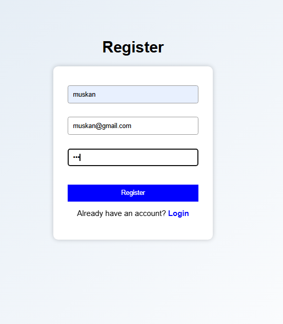
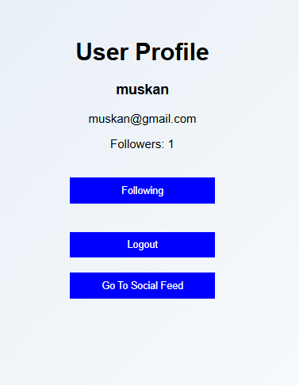
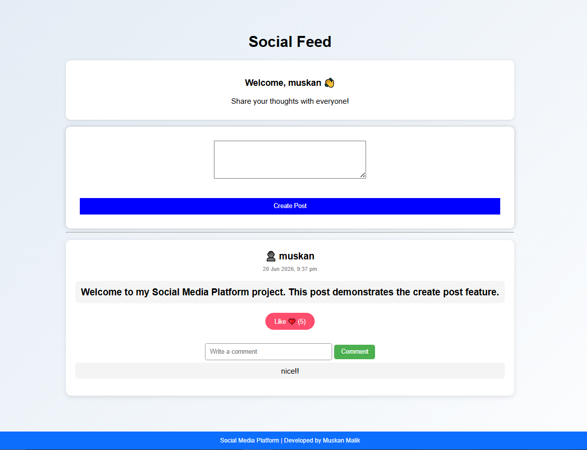

# 📱 Social Media Platform

A full-stack social media web application that allows users to create accounts, share posts, interact with content, and connect with other users.

---

## 🚀 Features

- User Registration
- User Login
- User Profile Management
- Follow System
- Create Posts
- Like Posts
- Comment on Posts
- Persistent Data Storage with MongoDB

---

## 🛠️ Tech Stack

### Frontend
- HTML
- CSS
- JavaScript

### Backend
- Node.js
- Express.js

### Database
- MongoDB Atlas
- Mongoose

---

## 📂 Project Structure

```
backend/
│
├── models/
└── server.js

frontend/
│
├── css/
├── js/
├── register.html
├── login.html
├── profile.html
└── index.html
```

---

## ▶️ Installation

1. Navigate to the backend folder

```bash
cd backend
```

2. Install dependencies

```bash
npm install
```

3. Create a `.env` file inside the backend folder

```env
MONGO_URI=your_mongodb_connection_string
```

4. Start the server

```bash
node server.js
```

5. Open `frontend/register.html` using Live Server.

---

## 📸 Screenshots

### Registration Page



### Profile Page



### Social Feed



---

## 🔮 Future Enhancements

- Password Encryption
- JWT Authentication
- User Search
- Image Uploads
- Real-Time Notifications

---

## 👩‍💻 Author

**Muskan**